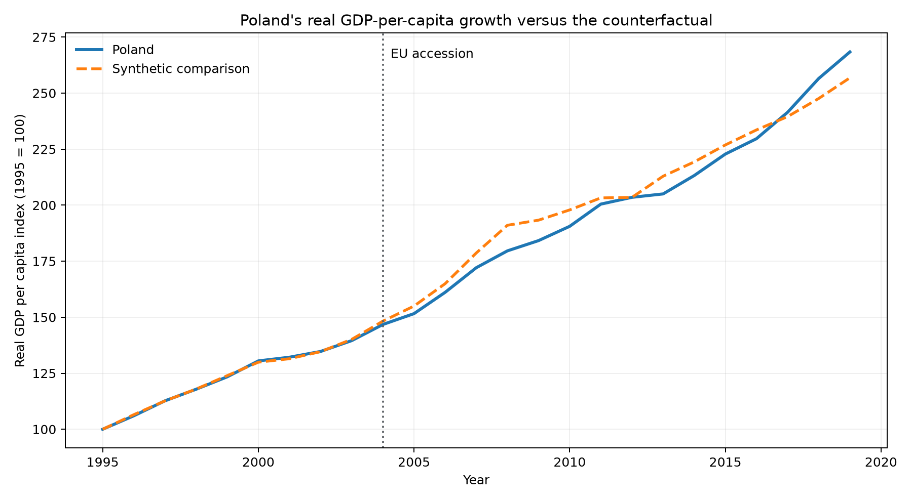

# Poland after EU accession: a comparative economic analysis

[](https://github.com/Mateusz-Szewczyk10/Portfolio_projects/actions/workflows/ci.yml)

An end-to-end public-data case study estimating how Poland's real GDP per
capita evolved after joining the European Union in 2004 relative to a
transparent, data-driven counterfactual.

This project is designed as a portfolio demonstration of analytical problem
framing, reproducible Python, SQL, causal reasoning, validation, and concise
business communication. It uses only public World Bank data and is unrelated
to proprietary employment data or processes.

## Decision question

Did Poland's post-2004 real GDP-per-capita path outperform a weighted
combination of comparable non-EU economies that matched its pre-accession
trajectory?

This is a comparative case study, not proof that EU membership alone caused
the observed difference. Accession coincided with many reforms and external
shocks. The design makes the counterfactual explicit and tests robustness with
in-space placebos, but it cannot eliminate all time-varying confounding.

## Result from the latest reproducible run

Poland's growth index averaged **1.6% below** the fitted comparison over
2004-2019 and ended **4.5% above** it in 2019. Among placebos with acceptable
pre-period fit, Poland ranked 4 of 4 on the post/pre error ratio: the data do not
show an unusually large post-2004 divergence. Leave-one-donor-out estimates
ranged from -9.5% to +1.2%, reinforcing the need for a cautious conclusion.

This is an informative negative result. It does not demonstrate that accession
had no effect; it shows that this design and donor pool cannot isolate a robust
effect from the public annual data.



## What this repository demonstrates

- A reproducible World Bank API ingestion and validation pipeline
- A tidy country-indicator panel queried with DuckDB SQL
- Constrained synthetic-control weights with pre-period fit diagnostics
- Placebo-based inference and sensitivity reporting
- Automated figures, tables, and an executive summary
- Unit tests, linting configuration, and continuous integration

## Project structure

```text
.
|-- src/poland_eu_analysis/   # reusable data and analysis code
|-- sql/                      # stakeholder-facing analytical SQL
|-- notebooks/                # thin narrative entry point
|-- tests/                    # deterministic unit tests
|-- data/                     # generated locally; raw data is not committed
|-- reports/                  # methodology and generated deliverables
|-- archive/                  # preserved earlier learning exercises
`-- pyproject.toml            # dependencies and tool configuration
```

## Reproduce the analysis

Python 3.11-3.13 is supported.

```powershell
python -m venv .venv
.\.venv\Scripts\python -m pip install -e ".[dev]"
.\.venv\Scripts\python -m poland_eu_analysis.pipeline
.\.venv\Scripts\python -m pytest
```

The pipeline downloads World Development Indicators through the public World
Bank V2 API, validates coverage, writes a tidy panel, executes the SQL analysis,
fits the comparative counterfactual, and creates the report under `reports/`.
Use `--offline` to rerun from a previously downloaded raw CSV.

## Analytical design

- **Primary outcome:** GDP per capita (constant 2015 US$), indexed to 100 in
  1995 so the estimator compares growth trajectories rather than income levels.
- **Study window:** 1995-2019. The end date excludes pandemic and subsequent
  geopolitical shocks from the primary estimate.
- **Intervention:** 2004, the year Poland joined the EU.
- **Donor pool:** selected non-EU economies from Europe and Central Asia with
  adequate data coverage and no EU accession during the study window.
- **Estimator:** non-negative donor weights constrained to sum to one and
  selected to minimize pre-2004 prediction error.
- **Diagnostics:** pre-period RMSPE, post/pre RMSPE ratio, donor concentration,
  leave-one-donor-out sensitivity, and in-space placebo comparisons.

See [reports/methodology.md](reports/methodology.md) for assumptions and
limitations. A dated output snapshot is included for reviewers and can be
rebuilt from the current World Bank API response.

## Data source

World Bank, World Development Indicators, accessed via the public
[Indicators API](https://datahelpdesk.worldbank.org/knowledgebase/articles/889392).
The API does not require authentication. Indicator definitions and revisions
remain the responsibility of the source provider.

## Archived work

Earlier tutorial and exploratory projects are preserved in
[archive/learning-exercises](archive/learning-exercises), but they are not part
of the showcased case study.

## License

Code is released under the MIT License. World Bank data is subject to the
source provider's terms and attribution requirements.
